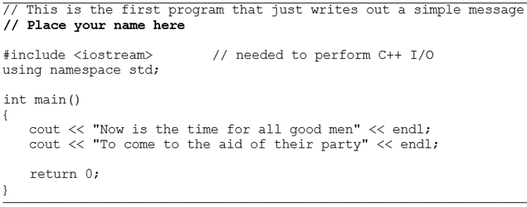
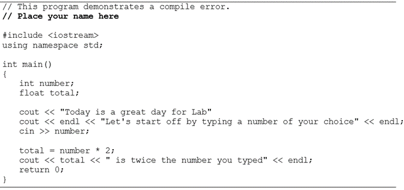
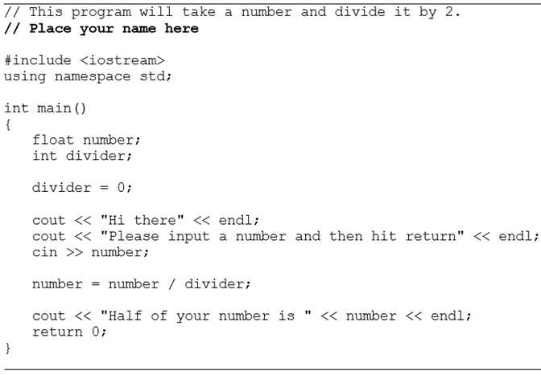
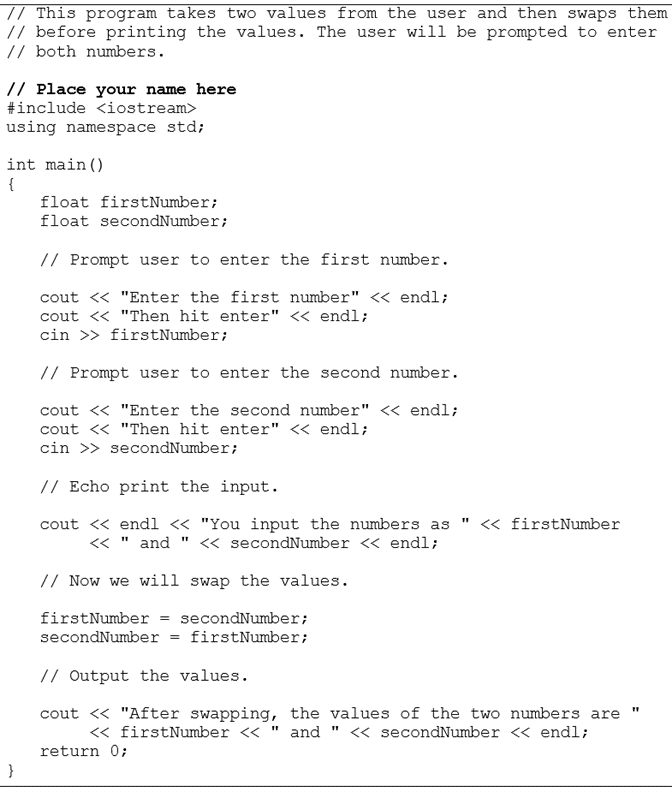

# C++ For Science - Lab 1

This template repository is the starter project for C++ For Science Lab 1. Written in C++.

### Question(s)

1. **Opening, Compiling and Running Your First Program  **

1.1. Logon to your computer system.  

1.2. Bring in the firstprog.cpp program from the Lab 1 folder.  

1.3. Compile the program.  

1.4. Run the program and write what is printed on the screen.  

The code of firstprog.cpp is as follows:  

2. **Compiling a Program with a Syntax Error**

2.1. Bring in the program semiprob.cpp from the Lab 1 folder.  

2.2. Compile the program. Here we have our first example of the many syntax errors that you no doubt will encounter in this course. The error message you receive may be different depending on the system you are using, but the compiler insists that a semicolon is missing somewhere.  

Unfortunately, where the message indicates that the problem exists, and where the problem actually occurs may be two different places. To correct the problem, place a semicolon after the line  
                cout << "Today is a great day for Lab"  
Most syntax errors are not as easy to spot and correct as this one.  

2.3. Re-compile the program and when you have no syntax errors, run the program and input 9 when asked. Record the output.  

2.4. Try running it with different numbers. Record your output.  
Do you feel you are getting valid output?  

The code of semiprob.cpp is as follows:  

3. **Running a Program with a Run Time Error**

3.1. Bring in program runprob.cpp from the Lab 1 folder.  

3.2. Compile the program. You should get no syntax errors.  

3.3. Run the program. You should now see the first of several runtime errors. There was no syntax or grammatical error in the program; however, just like commanding someone to break a law of nature, the program is asking the computer to break a law of math by dividing by zero. It cannot be done. On some installations, you may see this as output that looks very   strange. Correct this program by having the code divided by 2 instead of 0.  

3.4. Re-compile and run the program. Type 9 when asked for input.  
Record what is printed  

3.5. Run the program using different values. Record the output.  
Do you feel that you are getting valid output?  

The code of runprob.cpp is as follows:  

  

4. **Working with Logic Errors**
4.1. Bring in the program logicprob.cpp from the Lab 1 folder.  

The code of logicprob.cpp is as follows:  

  

4.2. Compile this program. You should get no syntax errors.  

4.3. Run the program. What is printed?  

4.4. This program has no syntax or run time errors, but it certainly has a logical error. This logical error may not be easy to find. Most logic errors create a challenge for the programmer.  

5. **Writing Your First Program**

5.1. Develop a design that leads to an algorithm and a program that will read in a number that represents the number of kilometers traveled. The program will convert this number to miles, and output equivalent miles.  

1 kilometer = 0.621 miles.  

Call this program kilotomiles.cpp.  

5.2. Compile the program. If you get compile errors, try to fix them and compile again until your program is free of syntax errors.  

5.3. Run the program. Is your output what you expect from the input you gave? If not, try to find and correct the logic error and run the program again. Continue this process until you have a program that produces the correct result.
